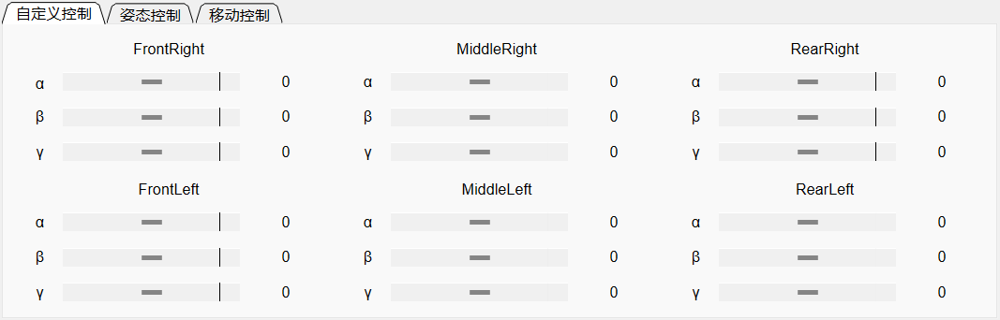

# 六足机器人

## 整体介绍

该项目利用了暑假期间的时间，主要包括六足机器人的机械设计、硬件选择以及软件控制。
由于经费有限，项目未能制造出完整的六足机器人。但我们通过3D打印定制了一组支撑腿，
以验证逆运动学控制和上位机系统的正确性。

## 机械结构

六足机器人由六个支撑腿及身体组件构成，支撑腿提供行走、转动等动作，身体组件则用来
放置一些硬件设施。

每个支撑腿由3个**mg996r舵机**提供动力，并且被固定在身体组件上

六足机器人的大部分结构件采用3D打印制造，清单如下：
* 舵机上安装件×1×6
* 舵机下安装件×1×6
* 舵机上固定件×1×6
* 舵机下固定件×1×6
* 环形连接件×1×6
* 身体固定板_上板×1
* 身体固定板_下板×1
* 下肢驱动板×1×6
* 下肢被动板×1×6
* 下肢固定板×1×6
* 中段驱动板×1×6
* 中段被动板×1×6
* 中段驱动板_加强×1×6
* 中段被动板_加强×1×6

部分结构件及连接件采用标准件，具体见[标准件统计](机械结构/标准件统计.xlsx)

## 硬件系统

由于时间和实验条件的原因，本项目均采用成品开发板。电源采用**18650 12V 5600
mA锂电池组**，使用**LM2596S DC-DC直流可调降压稳压模块**为开发板提供5V电压
舵机控制板采用**Yeahbot 24路舵机控制板**,使用**DX-BT04-E02模块**提供蓝牙
通信支持，使用**ATK-USB-URAT-V1.2模块**提供USB转串口通讯支持。

## 软件控制

控制程序由python编写，主要分为[模型控制](软件控制/源代码/hexapod/models.py)、
[通讯控制](软件控制/源代码/hexapod/communication.py)和
[操作界面](软件控制/源代码/hexapod/interface.py)，控制软件已经被打包为
[.exe可执行文件](软件控制/打包程序/dist/run.exe)。

操作界面由工具栏和主界面构成。用户可以选择通信方式，并且发送数据到舵机控制板，舵机控制指令
参考[使用手册](硬件系统/YH-24路舵机控制板学习资料/01.使用手册/Yeahbot-24路舵机控制板使用手册.pdf)。

初始化包括对body和leg的参数进行修改的子页面，可以对body的尺寸、初始位置做修改，还可以对
leg的尺寸、角度初始值、角度补偿、允许角度范围、基准坐标等修改。

通信连接包括串口通信和蓝牙通信的子页面，包括设置连接串口及蓝牙所需要的信息。

下方分页面处包括自定义控制、姿态控制和移动控制。

自定义控制允许用户单独控制每个舵机角度，并且每个角度值是实时更新的。

姿态控制用于改变非移动状态下六足机器人的姿态，可以通过按键对姿态进行控制，
也可以通过右侧输入框来对姿态进行设置。

移动控制用于控制六足机器人的前进、后退、转向等，可以选择三角步态或波动步态，
右侧自定义循环动作可以规定动作组，实现连续控制。

## 机器人运动展示

移动姿态

三角步态

波动步态

转向

## LICENSE

本项目采用MIT许可证，更多详情请参见[LICENSE 文件](LICENSE.txt)。